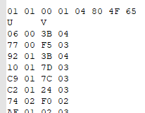

# **MDLX Model**

MDLX files commonly contain model data, which uses the BAR type 4.

<figcaption align="center">Model section in the MDLX's BAR header</figcaption>

Models start with a 0x90 empty bytes, which are used only at runtime and are not taken into account when using offsets.

<figcaption align="center">Reserved memory</figcaption>

From here, the model data starts.

# Headers

## Model Types

* Multi - A file that contains multiple models of the other types.
* Skeletal - Models with meshes and a skeleton. Mostly characters.
* Background - Models without a skeleton. Mostly maps.
* Shadow - A submodel that contains the shadow of the main model.

In this document I'll explain how skeletal models are structured.

## Headers

All of the models use a common header, followed by a specific header for each type.

<figcaption align="center">Skeletal model headers</figcaption>

### Model Header:

* Type (4B) - 1: Multi; 2: Skeletal; 3: Background; 4: Shadow
* Subtype (4B) - 0: Character (Skeletal) / Map (Background); 1: Background/Prop (Skeletal) / Skybox (Background)
* Attributes (4B)
* Size (4B) - The size of the main file. Starting address of the model's shadow's file if it exists. 0 if there's no shadow.

### Skeletal Model Header:

* Bone count (2B)
* Texture count (2B)
* Bone list offset (4B)
* Metadata offset (4B)
* Mesh count (4B)

A header for each mesh follows.

<figcaption align="center">Mesh headers</figcaption>

### Mesh Header:

* Attributes (4B)
* Texture index (4B)
* Polygon count (4B)
* Has vertex buffer (2B)
* Alternative (2B)
* DMA packet offset (4B)
* Bone weights offset (4B)
* DMA packet length (4B)
* Padding (4B)

# Skeletal data

## Metadata

The metadata contains the bounding box of the model, some inverse kinematics data and a list of bone indices which indicates which bone correspond to which part of a body.

* Bounding Box Min (Vector4, 16B)
* Bounding Box Max (Vector4, 16B)
* Inverse Kinematics Bone Bias (Vector4, 16B)
* Body part correspondences (56 indices, 4B each)
* Distance from skeleton (Vector4, 16B)

In the following example, the green box contains the bounding box and IK data, and the blue box contains the bones correspondences. In this case the character's head (0th value) is bone 0x8C (140) and their chest (8th value) is bone 0x43 (67).

<figcaption align="center">Model metadata</figcaption>

## Bones

After the headers comes the bone list. Each bone contains the following data:

* Index (2B)
* Sibling index (2B)
* Parent index (2B)
* Child index (2B)
* Reserved (4B)
* Flags (4B)
* Scale (Vector4, 16B)
* Rotate (Vector4, 16B)
* Translate (Vector4, 16B)

<figcaption align="center">Bone list</figcaption>

# Mesh data

Now then, what follows is the meat and bones of the file. Each mesh has 3 components, the VIF data, the DMA data and the Bone weights. While you may have an idea about how the bone weights work, the VIF and DMA data might be new terms for you. It's data stored to be used by PS2 hardware and it's packed and ready for it, so we'll have to understand how the PS2 hardware works first.

## Emotion Engine

You can check out the PS2's architecture at [Copetti](https://www.copetti.org/writings/consoles/playstation-2/), which looks like this:

<figcaption align="center">PS2 architecture</figcaption>

Don't get scared yet, we're only going to focus on a couple of things on the Emotion Engine ([Documentation](https://usermanual.wiki/Pdf/EEUsersManual.1748563585.pdf)).

Within the Emotion Engine we have the Vector Processing Units (VPU/VU). The VPUs are in charge of processing the graphics. To do so they receive the compressed data in our file through the Vector Interface (VIF), which will decompress it for the VPU to read.

To send data to the VPU through its interface the PS2 uses a Direct Memory Access Controller (DMAC) which receives the DMA code that instructs how to send the data to the VPU. These data transfers are made in groups of 16 bytes at a time, a quadword.

And that's it! In the MDLX we have the VIF code (Mesh), followed by the DMA code (Memory allocation), followed by a list of bone weights.

## DMA data

The DMA code consists of a series of DMA tags. DMA code is grouped in DMA chains, due to memory limits. Each chain is delimited by an end tag.

<figcaption align="center">2 DMA chains in a mesh</figcaption>

The DMA tags are 16 bytes long, where 8 of them are used for the tag and the other 8 can be used for additional parameters.

* QWC (2B) - Quadword count. The length of the VIF code in quadwords (16B)
* Padding (1B)
* ID/Flag (1B) - The DMA instruction
* Address (4B) - A memory address
* Parameter1 (4B)
* Parameter2 (4B)

We could divide each chain in 3 parts:

* The mesh tag. Its address points to the VIF code containing the mesh data and the QWC is the code's length in quadwords.
* The bone weight tags. They always use 4 quadwords, their address is the bone index, their 1st parameter is always 0x01010001, and the second parameter is a VIF code (More on this later)
* The chain end tag, which is always the same.

**NOTE:** Even if the code is split in multiple DMA chains, the resulting data must be read together! The code in a chain may reference data in the precious chain!

## VIF data

There's 2 ways of locating the mesh's VIF data. Either reading it from its DMA tag or by sequentially reading from the previous structure.

The VIF data contains the following in order:

* Header
* UV coordinates
* Vertex indices
* Triangle strips
* Positions
* Bone group counts

Each group starts with an unpack command (0x01010001) and is followed by the unpack parameters:

* Location in VPU memory (More on this later)
* Value length - 0x80: 4 bytes; 0xC0: 1 byte; 
* Read Count
* Read length - 0x6C: 16 bytes; 0x78: 12 bytes;  0x65: 4 bytes; 0x72: 1 byte

Eg: if I want to read integers in groups of 16 bytes from a 32 byte code to VPU address 0, it would be: 0x 00 80 02 6C

### VIF header

Params: 0x 00 80 04 6C

Reads 16 bytes (0x6C) 4 times (0x04), 4 bytes for each piece of data (0x80)

<figcaption align="center">VIF header</figcaption>

### UV coordinates

Params: 0x 04 80 XX 65 (Count is usually capped at 0x4F)

Each UV coordinate is 4 bytes long. 2 bytes per axis. The values are stored as X out of 4096, instead of a decimal out of 1. In addition, the V coordinate is inversed.

<figcaption align="center">UV coordinates</figcaption>

For the first UV coordinate, U is 0.00146484375 (6/4096) and V is 0.735595703125 (1 - 1083/4096).

This section ends with 0x 00 00 00 20 CF CF CF CF.

### Vertex indices

Params: 0x 04 C0 XX 72 (Count is usually capped at 0x4F)

Each index is 1 byte long, meaning we can't have more than 255 vertices on a VIF group.

<figcaption align="center">Vertex indices</figcaption>

After the last index there's a padding to align the code to 4 bytes long. This section ends with 0x 00 00 00 20 3F 3F 3F 3F.

### Triangle strips

Params: 0x 04 C0 XX 72 (Count is usually capped at 0x4F)

We have the following functions:

* 0x10: Vertex
* 0x20: Triangle with this vertex and the 2 before it in order (Eg: 312)
* 0x30: Triangle (Inverted) with this vertex and the 2 before it in reversed order (Eg: 321)

Each vertex has a UV coordinate, an index and a triangle strip function, so all of them have the same length. The first vertex has the first UV coordinate, the first index and the first triangle strip function, and so on and so forth.

<figcaption align="center">Triangle strips</figcaption>

In this example, we have the following strip: V1, V2, V3-triangle (3,1,2), V4-triangle-inv (432), V5-triangle (534), V6-triangle-inv (654) ...

After the last function there's a padding to align the code to 4 bytes long. This section ends with 0x 00 00 00 31 00 00 80 3F 00 00 80 3F 00 00 80 3F 00 00 80 3F 00 00 00 20 80 80 80 80.

### Positions

Params: 

* 0x 53 80 XX 78 (Single bone weight)
* 0x 53 80 XX 6C (Multiple bone weights)

Vertices are always assigned to a bone, and their position is relative to that bone. A position <1,1,1> is not position <1,1,1> from origin, it is <1,1,1> from its bone.

If every position is relative to a single bone each position has 3 floats, representing XYZ coordinates.

If we're using multiple weights for our vertices, each position has 4 floats, representing XYZ coordinates and the weight value to that bone.

Remember that each vertex usually has a single spatial position and multiple UV coordinates. In MDLX the spatial locations are stored once.

### Bone group counts

Params: 0x 9F 80 XX 6C 

The amount of indices that are assigned to bone number X. In the following example the first bone has the first 20 (0x14) vertices assigned and the second one has the next 17 (0x11) vertices assigned. The list of these bones comes after the DMA data.

Note that we're reading in groups of 16 bytes (4 counts at once) In the previous example we have 10 counts, so the last row has the last 2 counts + 2 extra padding entries.

This section ends with 0x 00 00 00 00 00 00 00 00.

## Bone list

Right after the DMA data comes the bone list, which follows a simple structure. Each entry has 4 bytes. The first entry is the entry count (Not counting itself) and then each entry is a bone index. 0x FF FF FF FF is the division between DMA chains.

In this example we have 433 (0x1B1) entries, the first bone is bone 53 (0x35) which had 20 vertices assigned, and the second bone is bone 2 (0x02) which had 17 vertices assigned. The second chain's first bone is bone 53 (0x35) and the second one is bone 47 (0x2F)

This section ends with a padding to align the data to 16 bytes.

 

# The data in VPU memory

**NOTE:** The data I've shown above corresponds to the file P_EX100.mdlx. The data I'm showing in this section corresponds to file F_EX030.mdlx, which is simpler but follows the same structure.

After the VIF unpacks the data, it looks like this in memory:

At quadword 0x00 we have the header data (4 quadwords)

At quadword 0x04 we have the vertex list (1 quadword each) which contains their index, UV coordinate and triangle strip function.

 

At quadword 0x53 we have the position list (1 quadword each) with the XYZ position and the Weight if it was used. (At quadword 0x6C starts the vertex list for the next bone)

<figcaption align="center">Single weight</figcaption>

<figcaption align="center">Multiple weights</figcaption>

At quadword 0x77 we have the bone group counts.

If the model uses multiple weights the matrices to assign the bones follow. I haven't worked with this yet so I don't know how it works currently.

After the VIF data there's a reserved space for the bone list. 4 Quadwords per bone. First bone is at quadword 0x78 second one is at quadword 0x7C.

You can check out the VPU memory for F_EX030 (Single weights) and H_EX500's (Multiple weights) first VIFs in the files folder of this repository. Provided by [KenjiUno](https://github.com/kenjiuno).

 

# DMA tags part 2

Remember how we left some DMA tags for later? Notice how I wrote the addresses in VPU memory in quadwords? Now you'll see why.

This is the DMA data of the mesh. The first 4 tags correspond to the VPU memory shown above and now we have the knowledge to explain each of them.

<figcaption align="center">Bone list</figcaption>

* First comes the mesh tag, which contains the length of the VIF code in quadwords (0x44) and the address in the file for the VIF code (0x0260)
* The second tag corresponds to the first bone. It uses 4 quadwords in memory, in the address section we have the bone's index and in P1 we have a VIF code "0x 78 80 04 6C". The first byte is the position in memory in quadwords (Does it make sense now?) while the others are always the same and work the same as they did when unpacking the VIF code. P0 seems to always be "0x 01 01 00 01".
* The third tag is the next bone. Bone 0x02, which is located at 0x7C in VPU memory.
* Last goes the end tag for the chain.