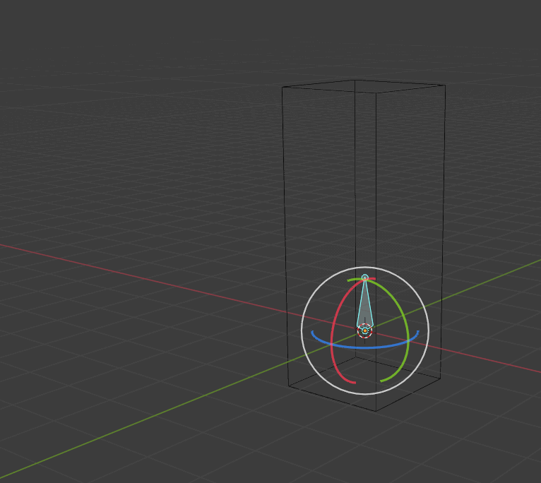

# **Model Structures**

In this section I'll explain how 3D data is structured and used, which will help us understand how the data in a MDLX file is stored.

# Meshes

A bunch of vertices that connect forming faces. The faces can connect a different amount of vertices, but they most commonly connect 3 of them to form a triangle. A model can contain multiple meshes.

<figcaption align="center">A mesh with a face selected</figcaption>

Do note that faces have a direction they face, and the other side won't be rendered. This is called [back-face culling](https://en.wikipedia.org/wiki/Back-face_culling). The face that is rendered is decided by the order of the face's vertices. Either clockwise or counterclockwise. Some applications allow you to render both sides of the faces.

<figcaption align="center">A face rendering only on its front</figcaption>

<figcaption align="center">Front face</figcaption>

## **Structure**

Each vertex has a spatial location (X,Y,Z).

Each face has 3 vertex indices, ordered either clockwise or counterclockwise.

# Materials

Each mesh can have a material with a multitude of properties.

## **Maps**

### Base color/Albedo/Diffuse/Texture

Defines the color of the object.

### Normal

Gives the illusion of depth on a flat surface by modifying how the light bounces off of it.

For more info: [Texture Maps Explained - PBR Workflow](https://www.youtube.com/watch?v=PjGCtnEDDeU)

<figcaption align="center">Material maps</figcaption>

## **Structure**

The maps are stored as images. (Either in the model file or filepaths to the images)

The material has the maps.

Each mesh has a material assigned.

# UV map

UV coordinates define how the material's texture is projected to the mesh.

<figcaption align="center">UV Map</figcaption>

## **Structure**

UV coordinates are stored as a pair of decimals representing a percentage of the texture's height/width, from 0 to 1.

# Spatial + UV vertices

A vertex not only has a spatial location (X,Y,Z), but also a UV location. What appears to be a single vertex may be a group of vertices in the same spatial location.

<figcaption align="center">3 vertices in the same XYZ location</figcaption>

<figcaption align="center">Vertices sharing a spatial location but different UV location</figcaption>

## **Triangle Strips**

The vertices and faces can be stored in multiple ways. In the following image, the UV coordinate (0.5,0.66) is related to 6 faces.

If we store each face with their 3 vertices, we'd have the same vertex (XYZUV) 6 times. We could, however, store the vertex once and reference it in all 6 faces. This is called a [Triangle strip](https://en.wikipedia.org/wiki/Triangle_strip) (Also called TriStrip).

# Skeleton

In order to animate a model, the meshes have to move in a certain way. To achieve this, we assign a group of vertices that move together to a Bone.

<figcaption align="center">Mesh assigned to bone (0,0,0) rotating with it</figcaption>

**Note:** the mesh will rotate/scale/translate based on the bone's coordinates, not the mesh's.

<figcaption align="center">Mesh assigned to bone (0,0,0) rotating and scaling</figcaption>

A skeleton is a group of bones that are structured in a parent-child relationship in such a way that if the parent moves its children will move with it.

<figcaption align="center">Arm < elbow < chest bones moving</figcaption>

The assignation of a vertex to a bone is called "Weight".

A vertex can be assigned to multiple bones (Have multiple weights). This is stored as a decimal representing how much that bone affects the vertex, from 0 to 1.

## **Structure**

Bones are stored as a 4x4 matrix, representing their location, rotation(direction) and scale.

Bones store the index of their parent and may store data about their children and/or their siblings (Other bones that are direct children of its parent)

  

# **Extra**

# Bounding Box

A bounding box is a box that contains a mesh/bone, usually the smallest box possible. They are used for collision detection.

<figcaption align="center">Spatial vertex</figcaption>

# Lightning

### Ambient

A light that illuminates all of the model.

### Diffuse

Directional light.

### Specular

Light that bounces off of the objects.

<figcaption align="center">Lightning</figcaption>

